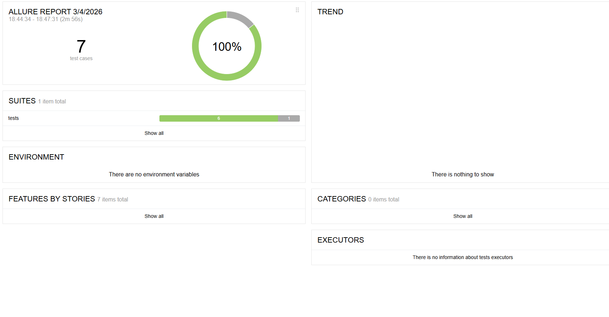

# Tandoor Automation Test Project

Automation test project for the **Tandoor Recipes** web application.

## Stack
- Python
- Pytest
- Selenium
- Requests
- Allure Report
- Page Object Model

## Test Coverage

### API Tests
- Get recipes
- Create recipe
- Delete recipe

### UI Tests
- Open homepage
- Login
- Open meal plan page

### UI + API Flow
- Create meal plan via UI
- Validate via API
- Delete meal plan

## How to run

### 1) Install dependencies
> Это команда для терминала (PowerShell / cmd)

```bash
pip install -r requirements.txt

